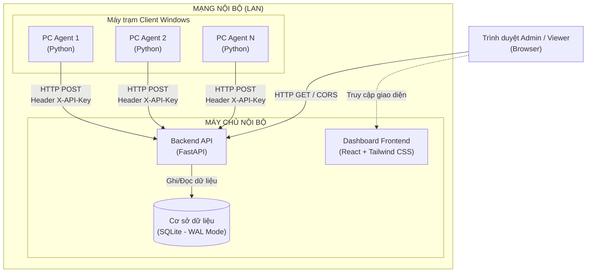

# NetDevice Manager 🖥️

**NetDevice Manager** là hệ thống giám sát và quản lý thiết bị máy tính trạm nội bộ doanh nghiệp tập trung. Hệ thống cho phép tự động thu thập thông tin cấu hình phần cứng chi tiết, tài nguyên tải động (CPU, RAM, Disk) và danh sách phần mềm cài đặt từ các máy khách (Client Windows) gửi về máy chủ nội bộ thông qua kết nối bảo mật để hiển thị trực quan lên Dashboard Web.

---

## 📐 Kiến trúc hệ thống



---

## 📂 Cấu trúc dự án

```
netdevice-manager/
├── server_setup.bat          # File cài đặt dependencies Backend & Frontend
├── server_run.bat            # File khởi chạy đồng thời Backend & Frontend
├── server_stop.bat           # File dừng toàn bộ các tiến trình Server
├── server_update.bat         # File cập nhật code mới từ Git & nâng cấp dependencies
├── agent/                    # Cấu phần cài trên client máy khách
│   ├── agent.py              # Script thu thập dữ liệu (PowerShell/winreg/UUID/API-Key)
│   ├── config.json           # Cấu hình địa chỉ server, token và UUID trạm
│   ├── requirements.txt      # Dependencies Python của Agent (psutil, requests)
│   ├── setup.bat             # File cài đặt cấu hình & đăng ký chạy ngầm Task Scheduler
│   ├── run.bat               # Script khởi chạy Console & kích hoạt Task chạy ngầm
│   ├── stop.bat              # Script dừng cả tiến trình Console lẫn Task chạy ngầm
│   ├── update.bat            # Script tự động cập nhật code Agent mới nhất từ Repo
│   ├── install.bat           # File cài đặt phụ trợ (được gọi bởi setup.bat)
│   └── README.md             # Hướng dẫn chi tiết cài đặt Agent
│
├── server/                   # Cấu phần Server Backend
│   ├── main.py               # Điểm khởi chạy FastAPI, API Key auth và background jobs
│   ├── database.py           # SQLite kết nối tối ưu chế độ WAL và busy_timeout
│   ├── models.py             # Lược đồ cơ sở dữ liệu SQLAlchemy ORM và Pydantic schemas
│   ├── requirements.txt      # Dependencies Server (FastAPI, SQLAlchemy, Uvicorn)
│   ├── README.md             # Hướng dẫn vận hành và cấu hình cổng/tường lửa
│   └── routes/               # Thư mục chứa các API routes phân nhánh
│       ├── devices.py        # API CRUD thiết bị, metadata và lịch sử 24h
│       ├── dashboard.py      # API thống kê tổng quan, cơ cấu OS/phòng ban và cảnh báo đĩa
│       └── reports.py        # API quét phần mềm toàn diện mạng và xếp hạng cài đặt
│
└── frontend/                 # Cấu phần Frontend Dashboard web
    ├── index.html            # File HTML gốc (Đã được tối ưu hóa tiêu đề chuẩn SEO)
    ├── package.json          # Quản lý dependencies (React 19, Recharts, Lucide Icons)
    ├── tailwind.config.js    # Cấu hình quét tệp và mở rộng bảng màu HSL Brand cao cấp
    ├── postcss.config.js     # PostCSS hỗ trợ Tailwind CSS
    ├── vite.config.js        # Cấu hình Vite bundler
    └── src/
        ├── main.jsx          # Entry point của React
        ├── App.jsx           # Điều phối điều hướng (Routing)
        ├── index.css         # Import Tailwind, font Plus Jakarta Sans và glassmorphism
        └── components/       # UI Components chung
        └── pages/            # Các trang giao diện chính (Dashboard, DeviceList,...)
```

---

## 💎 Điểm sáng kỹ thuật & Tối ưu hóa cao cấp

*   **Bảo mật nội bộ an toàn:** Truyền tải xác thực thông qua Header `X-API-Key` chặn đứng hoàn toàn việc giả mạo gói tin báo cáo trong mạng nội bộ LAN.
*   **Tương thích Windows 11+:** Gọi truy vấn **PowerShell CIM** (`Get-CimInstance`) kết hợp đọc Registry nâng cao thay thế hoàn toàn công cụ `wmic` đã bị khai tử bởi Microsoft.
*   **SQLite WAL Mode & Concurrency:** Kích hoạt chế độ **WAL (Write-Ahead Logging)** kết hợp busy_timeout 30s xử lý ghi đồng thời mượt mà, triệt tiêu lỗi tranh chấp khóa.
*   **Thuật toán UPSERT phần mềm tối ưu:** Nhận diện và chỉ cập nhật sự thay đổi (Add new / Update version / Delete obsolete) của danh sách phần mềm thay vì xóa ghi lại hàng loạt, giảm hao mòn đĩa cứng và tăng tốc độ xử lý dữ liệu.
*   **Định danh tự phục hồi:** Tạo mã UUID ngầm lưu song song tại `config.json` và **Windows Registry** (`HKCU`). Thiết bị không bị đổi định danh trên dashboard kể cả khi cài lại hoặc xóa file cấu hình.
*   **Hiệu năng UI đỉnh cao:** Thiết kế Kính mờ (glassmorphism) hiện đại, trang bị **Virtual list & Pagination** cho bảng danh sách hàng trăm phần mềm giúp trình duyệt render tức thì không giật lag.

---

## 🚦 Hướng dẫn khởi chạy nhanh bằng Script (.bat)

Hệ thống đã được trang bị sẵn các tệp kịch bản lệnh `.bat` chạy tự động chỉ bằng 1 cú nhấp chuột tiện lợi cho cả Client (Agent) và Server.

### A. Quản lý Máy chủ (Server - FastAPI & React Dashboard)
Các kịch bản lệnh được đặt ngay tại **thư mục gốc** của dự án:
1.  **Cài đặt toàn bộ (Setup):** Kích hoạt [server_setup.bat](file:///server_setup.bat) để tự động khởi tạo môi trường ảo Python venv, cài đặt các dependencies Backend và đồng thời tải các gói thư viện Node.js cho Frontend.
2.  **Khởi chạy hệ thống (Run):** Kích hoạt [server_run.bat](file:///server_run.bat) để khởi động song song Backend API (Cổng `8085`), Frontend Web (Cổng `5173`), và tự động mở trình duyệt truy cập thẳng vào Dashboard.
3.  **Dừng hệ thống (Stop):** Kích hoạt [server_stop.bat](file:///server_stop.bat) để tắt sạch các cửa sổ console đang chạy ngầm và giải phóng các cổng mạng an toàn.
4.  **Cập nhật hệ thống (Update):** Kích hoạt [server_update.bat](file:///server_update.bat) để tự động kéo mã nguồn mới nhất từ Git Repository và nâng cấp các dependencies Backend/Frontend tương ứng chỉ với 1 cú nhấp chuột.

### B. Quản lý Máy khách (Client - Agent giám sát)
Các kịch bản lệnh nằm bên trong thư mục [agent/](file:///agent/) trên máy khách:
1.  **Cài đặt & Đăng ký ngầm (Setup):** Nhấp chuột phải vào [agent/setup.bat](file:///agent/setup.bat) -> Chọn **Run as Administrator** (Chạy với quyền Admin). Nhập địa chỉ Server, cấu hình phòng ban và token bảo mật. Agent sẽ tự động cấu hình, sinh mã định danh UUID vĩnh viễn và đăng ký dịch vụ chạy ngầm vĩnh viễn qua Windows Task Scheduler.
2.  **Chạy thử nghiệm (Run):** Kích hoạt [agent/run.bat](file:///agent/run.bat) để chạy console theo dõi trực tiếp logs gửi dữ liệu thời gian thực về Server.
3.  **Dừng giám sát (Stop):** Kích hoạt [agent/stop.bat](file:///agent/stop.bat) để tạm dừng cả tiến trình console lẫn dịch vụ chạy ngầm trên máy trạm.
4.  **Cập nhật Agent (Update):** Kích hoạt [agent/update.bat](file:///agent/update.bat) để tự động nâng cấp tệp `agent.py` và dependencies lên phiên bản mới nhất từ Git (đối với môi trường Dev) hoặc tải trực tiếp mã nguồn từ GitHub (đối với máy trạm độc lập).

---

## 📝 Tài liệu hướng dẫn chi tiết
*   Hướng dẫn cụ thể về Agent: [agent/README.md](file:///agent/README.md)
*   Hướng dẫn cụ thể về Server Backend: [server/README.md](file:///server/README.md)
*   Hướng dẫn cụ thể về Giao diện: [frontend/README.md](file:///frontend/README.md)
