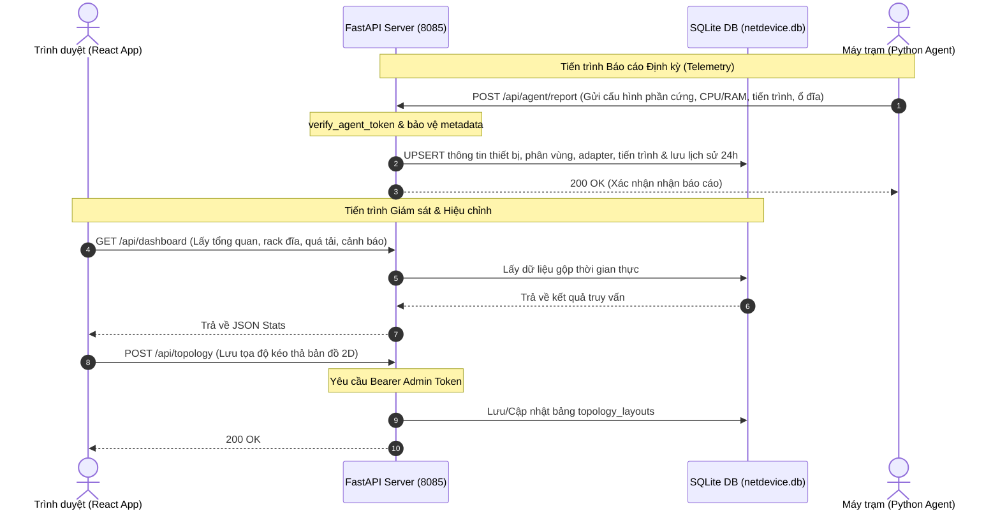

# 🏛️ Tài liệu Cấu trúc & Kiến trúc Hệ thống NetDevice Server

Tài liệu này cung cấp cái nhìn chi tiết về cấu trúc thư mục, mô hình cơ sở dữ liệu, sơ đồ luồng dữ liệu, và các API đầu cuối của ứng dụng Backend **NetDevice Server** viết bằng **FastAPI** (Python 3.8+).

---

## 🗺️ Sơ đồ Kiến trúc & Luồng dữ liệu (System Architecture)

NetDevice hoạt động theo mô hình **Agent-Server-Client (React Dashboard)** khép kín trong mạng nội bộ (LAN):



---

## 📂 Kiến trúc Thư mục & Vai trò của các File

Thư mục `server/` được thiết kế theo mô hình MVC thu gọn, chia nhỏ các routers theo nhóm chức năng:

```text
server/
├── routes/                      # Thư mục chứa các module router (Controllers)
│   ├── dashboard.py             # API phục vụ trang tổng quan (stats, rack view, avg tải)
│   ├── devices.py               # API quản lý thiết bị (CRUD, thông số 24h, chỉnh sửa metadata)
│   ├── reports.py               # API tra cứu liên thông diện rộng phần mềm & tiến trình
│   └── topology.py              # API tải và lưu trữ bản vẽ sơ đồ mạng 2D phẳng
├── auth.py                      # Xác thực admin (Bearer Token) tránh phụ thuộc vòng (circular imports)
├── database.py                  # Cấu hình SQLAlchemy Engine, SessionLocal & kết nối SQLite
├── main.py                      # Điểm khởi chạy (Entrypoint), CORS, API nhận báo cáo telemetry từ Agent
├── models.py                    # Khai báo các mô hình dữ liệu (ORM Tables) của SQLAlchemy
├── netdevice.db                 # File Cơ sở dữ liệu SQLite thực tế (khởi tạo tự động)
├── requirements.txt             # Danh sách thư viện Python phụ thuộc
└── server_tray.py               # Ứng dụng khay hệ thống (System Tray) quản trị ngầm Server bằng Tkinter
```

---

## 🗄️ Mô hình Cơ sở Dữ liệu (SQLite Database Models)

NetDevice Server sử dụng **SQLite** cấu hình chế độ **WAL (Write-Ahead Logging)** cho phép ghi/đọc đồng thời cực nhanh, chống khóa database khi hàng chục Agent gửi báo cáo cùng lúc.

### 📋 Bảng `devices` (Thiết bị trạm)
Lưu trữ thông tin cấu hình phần cứng cốt lõi và các thẻ thông tin tùy biến của quản trị viên:

| Tên Cột | Kiểu Dữ Liệu | Khóa | Mô tả |
| :--- | :--- | :--- | :--- |
| `device_id` | String | PK | ID duy nhất sinh ra từ cấu hình phần cứng của Agent |
| `hostname` | String | - | Tên định danh gốc của máy trạm |
| `client_name` | String | - | Tên tùy biến hiển thị trên Dashboard (khóa bảo vệ) |
| `ip_address` | String | - | Địa chỉ IPv4 hiện tại |
| `mac_address` | String | - | Địa chỉ MAC chính |
| `os_name` | String | - | Tên Hệ điều hành (Windows 11, Windows 10...) |
| `cpu_model` | String | - | Tên mã chip CPU |
| `cpu_cores` | Integer | - | Số nhân CPU vật lý |
| `ram_total_gb` | Float | - | Tổng dung lượng RAM vật lý (GB) |
| `current_user` | String | - | Tài khoản Windows đang đăng nhập |
| `owner` | String | - | Người phụ trách máy (khóa bảo vệ khi chỉnh sửa) |
| `location` | String | - | Vị trí văn phòng lắp đặt (khóa bảo vệ) |
| `department` | String | - | Phòng ban nghiệp vụ (khóa bảo vệ) |
| `is_online` | Boolean | - | Trạng thái Online/Offline của thiết bị |
| `last_seen` | DateTime | - | Mốc thời gian cuối cùng nhận được báo cáo |
| `description` | Text | - | Ghi chú/Mô tả chức năng chi tiết của máy trạm |

### 📋 Bảng Phụ thuộc 1-N (One-to-Many Relationships)
- **`disk_partitions`**: Lưu trữ dung lượng phân vùng ổ cứng.
  - *Cột:* `id` (PK), `device_id` (FK), `device` (C:, D:), `mountpoint`, `total_gb`, `used_gb`, `usage_percent`.
- **`network_adapters`**: Lưu trữ các card mạng khả dụng.
  - *Cột:* `id` (PK), `device_id` (FK), `name`, `ip_address`, `mac_address`.
- **`softwares`**: Danh mục các phần mềm đã cài đặt trên máy.
  - *Cột:* `id` (PK), `device_id` (FK), `name`, `version`, `install_date`.
- **`running_processes`**: Các tiến trình đang hoạt động định kỳ.
  - *Cột:* `id` (PK), `device_id` (FK), `pid`, `name`, `cpu_usage`, `ram_usage`.
- **`historical_metrics`**: Lưu lịch sử phụ tải CPU/RAM trong 24h để vẽ biểu đồ line.
  - *Cột:* `id` (PK), `device_id` (FK), `cpu_usage`, `ram_usage`, `timestamp`.

### 📋 Bảng `topology_layouts` (Bản đồ mạng 2D)
Lưu vĩnh viễn sơ đồ phẳng kéo thả văn phòng tập trung trên Server:
- `id` (Integer - PK)
- `nodes` (Text/JSON String): Danh sách vị trí tọa độ `(x, y)` của Server, PC trạm.
- `elements` (Text/JSON String): Danh sách các vật dụng văn phòng tự thiết kế (Tường, Bàn bếp, Ghế, Cửa...).
- `updated_at` (DateTime): Thời điểm cập nhật cuối cùng.

---

## 🔒 Cơ chế Bảo mật & Bảo vệ Dữ liệu (Security & Protection Policies)

### 1. Xác thực Đầu cuối (Bearer Token Auth)
Các endpoints thay đổi dữ liệu sơ đồ, thông tin thiết bị hoặc xóa máy trạm đều được bảo vệ bởi FastAPI Dependency `verify_admin_token` đặt tại `auth.py`. 
- Trình duyệt gửi Token qua header: `Authorization: Bearer <secret_token>`.
- Token hợp lệ mới cho phép truy xuất dữ liệu từ Database, ngược lại trả về `401 Unauthorized` ngay từ tầng lọc.

### 2. Khóa bảo vệ Metadata khỏi Agent (Metadata Override Protection)
Tránh lỗi nghiêm trọng: Khi người dùng đổi tên người phụ trách (`owner`), vị trí (`location`), phòng ban (`department`) hay tên hiển thị (`client_name`) trên giao diện React, nhưng 10 giây sau Agent gửi telemetry mới lên lại ghi đè/nhảy về giá trị cũ.
- **Giải pháp:** Trong endpoint `/api/agent/report` của `main.py`, Server thực hiện kiểm tra: Chỉ cho phép ghi đè các trường trên từ Agent lên Server khi giá trị hiện tại trên Server là mặc định/trống (`None`, `"Chua ro"`, `"Chưa rõ"`).
- Khi quản trị viên đã chủ động đặt giá trị tùy biến trên Server, Server sẽ khóa cứng trường đó và bỏ qua mọi thay đổi metadata này từ phía Client Agent gửi lên.

---

## 🌐 Hệ thống API Đầu cuối (API Endpoints Map)

| Nhóm | Phương thức | Endpoint | Yêu cầu Auth | Chức năng chính |
| :--- | :--- | :--- | :--- | :--- |
| **Auth** | `POST` | `/api/auth/login` | Không | Đăng nhập tài khoản Admin, cấp Bearer Token |
| **Telemetry** | `POST` | `/api/agent/report` | Token nội bộ | Endpoint nhận JSON báo cáo định kỳ từ Client Agent |
| **Dashboard** | `GET` | `/api/dashboard` | Không | Lấy gộp cấu trúc Rack đĩa, máy quá tải, avg tải toàn mạng |
| **Devices** | `GET` | `/api/devices` | Không | Lấy danh sách toàn bộ thiết bị trạm (rút gọn) |
| | `GET` | `/api/devices/{device_id}` | Không | Chi tiết cấu hình phần cứng, tiến trình, phần mềm của 1 máy |
| | `GET` | `/api/devices/{device_id}/metrics` | Không | Lấy mảng dữ liệu lịch sử tải CPU/RAM trong 24h |
| | `PUT` | `/api/devices/{device_id}` | Admin Token | Chỉnh sửa tên hiển thị, mô tả, phòng ban, vị trí, người dùng |
| | `DELETE` | `/api/devices/{device_id}` | Admin Token | Xóa thiết bị khỏi hệ thống giám sát |
| **Topology** | `GET` | `/api/topology` | Không | Tải sơ đồ phẳng mạng LAN 2D |
| | `POST` | `/api/topology` | Admin Token | Lưu vĩnh viễn tọa độ các nút sơ đồ phẳng mạng LAN 2D |
| **Reports** | `GET` | `/api/reports/software/search` | Không | Tra cứu liên thông diện rộng phần mềm & tiến trình |
